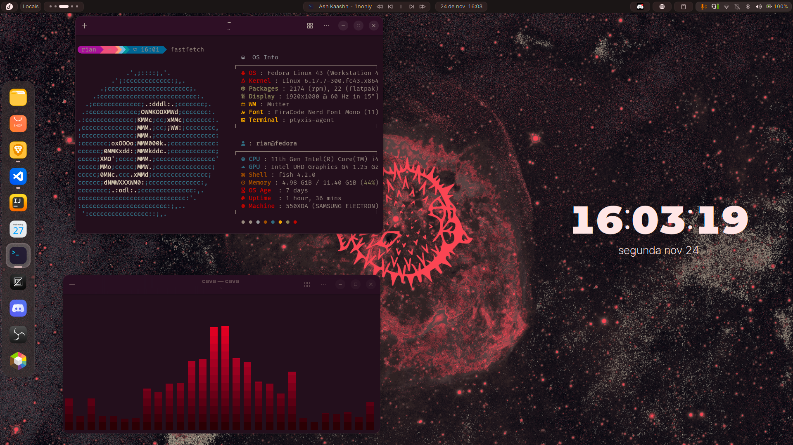

# Gnome customize

quick and beautiful customization gnome 


## Screenshots




## Instalação


```bash

    git clone https://github.com/user2510s/dotfiles.git
    cd dotfiles 
    chmod +x setup.sh
    ./setup.sh


```
    
## Autores

- [@user2510s](https://github.com/user2510s)

